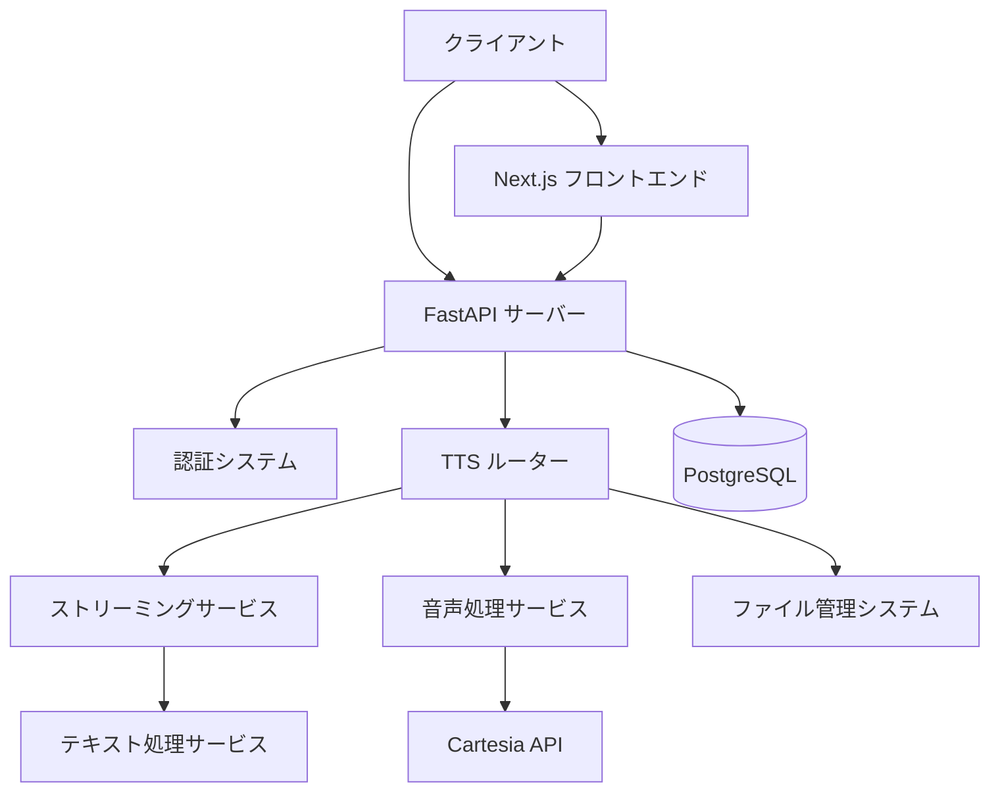

# システムパターン

## システムアーキテクチャ

本プロジェクト「テキスト読み上げ API サーバー」は、以下の主要コンポーネントから構成されています：

1. **FastAPI サーバー**: RESTful API エンドポイントを提供
2. **TTS 処理エンジン**: テキスト読み上げの中核処理を担当
3. **ストリーミングサービス**: PCM音声のリアルタイム配信
4. **音声処理サービス**: Cartesia APIとの連携、音声データ変換
5. **テキスト処理サービス**: GINZA NLPによる文分割と前処理
6. **ファイル管理システム**: 生成した音声ファイルを管理
7. **認証システム**: APIキーによるアクセス制御
8. **データベース**: 将来的にはジョブ情報や生成ファイルの情報を保存（現状はメモリ内管理）
9. **フロントエンド**: Next.js ベースのウェブインターフェース（開発中）

## 重要な技術的決定

### 1. FastAPI の採用

- **理由**: 高性能な非同期処理、自動ドキュメント生成、Python の型ヒントを活用した堅牢性
- **代替案**: Flask, Django REST Framework
- **メリット**: 開発速度が速く、非同期処理に優れ、自動生成される Swagger UI が便利

### 2. Cartesia API の利用

- **理由**: 高品質な日本語音声合成を専門とするサービス
- **代替案**: Google Cloud TTS, Amazon Polly
- **メリット**: 日本語特化の自然な音声品質、シンプルな API インタフェース

### 3. 文単位処理とGINZA NLPの統合

- **理由**: 自然な音声合成のための高精度な文分割
- **代替案**: 正規表現による簡易分割、他のNLPライブラリ
- **メリット**: 日本語特化の高精度、自然な読み上げリズム

### 4. PCM音声フォーマットの採用

- **理由**: シンプルで高品質な音声処理、ブラウザでの再生が容易
- **代替案**: MP3、AAC
- **メリット**: 処理が軽量、互換性が高い、デバッグが簡単

### 5. ストリーミング処理の実装

- **理由**: リアルタイム音声配信による即座の再生開始
- **代替案**: ファイル完成後の一括配信
- **メリット**: 低遅延、ユーザー体験向上、サーバーリソース効率化

### 6. Docker 活用

- **理由**: 環境の一貫性確保、デプロイの簡素化
- **代替案**: 直接ホストにインストール
- **メリット**: 依存関係の管理簡素化、スケーラビリティ向上、開発環境と本番環境の一致

## 使用中の設計パターン

### 1. モジュール分離パターン

API設計において、機能ごとに明確にモジュールを分離し、責任を分担しています：

- ルーター層：HTTPリクエスト/レスポンス処理
- サービス層：ビジネスロジック処理
- ユーティリティ層：共通機能提供

### 2. ストリーミングパターン

音声データを即座に配信するためのリアルタイムストリーミング処理パターンを実装しています。

### 3. 文単位処理パターン

テキストを文単位で分割し、各文ごとに独立して音声合成を行うことで、自然な読み上げを実現しています。

### 4. 認証パターン

APIキーによるヘッダーベース認証を実装し、セキュリティを確保しています。

### 5. リソース管理パターン

生成した音声ファイルを一時的に保存し、定期的にクリーンアップすることで、リソースを効率的に管理しています。

### 6. エラーハンドリングパターン

各層でのエラーを適切にキャッチし、ユーザーに分かりやすいエラーメッセージを提供しています。

## コンポーネントの関係

### API サーバー <-> ルーター層

- API サーバーは FastAPI のルーター機能により、エンドポイントごとの処理を分離
- 認証、リクエスト検証、レスポンス生成を担当

### ルーター層 <-> サービス層

- ルーター（tts_router）はHTTPレイヤーの処理のみ担当
- ビジネスロジックはサービス層（streaming_service, audio_service, text_service）に委譲

### サービス層内の連携

- **streaming_service**: 文単位ストリーミング処理の制御
- **audio_service**: Cartesia API連携と音声データ処理
- **text_service**: GINZA NLPによる文分割処理

### サービス層 <-> 外部API

- audio_service が Cartesia API との通信を担当
- レスポンスデータの解析と変換処理

### サービス層 <-> ユーティリティ層

- **file_utils**: ファイル管理と自動クリーンアップ

### API サーバー <-> 認証システム

- 各エンドポイントでAPIキー認証を実行
- 開発環境での認証スキップ機能

### API サーバー <-> データベース

- 将来的に実装予定の関係
- ジョブ情報、音声ファイル情報などを永続化
